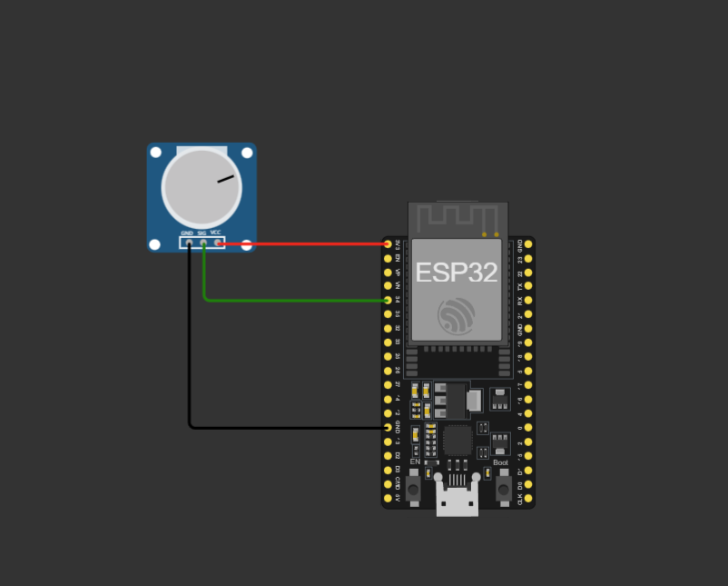

# SPO2 - Controle de oxigenação no corpo

# Visão geral
A sigla SPO2 refere-se à Saturação Periférica de Oxigênio. É um indicador crucial da quantidade de oxigênio presente na corrente sanguínea. Medido em porcentagem, o SPO2 representa a proporção de hemoglobina oxigenada em relação à hemoglobina total no sangue. Dispositivos como oxímetros de pulso são comumente usados para monitorar o SPO2, proporcionando informações importantes sobre a saúde respiratória e a eficácia da oxigenação do corpo. Valores normais geralmente situam-se entre 95% e 100%, indicando uma boa oxigenação sanguínea.

Projeto: https://wokwi.com/projects/382236197125975041

# Componentes

Hardware:
- Esp32
- Potenciômetro

Software:
- Código Esp32: Como o potenciômetro ele identifica qual o nível de oxigenação no corpo do paciente.

# Como funciona:

- Potenciômetro: Irá identificar se a oxigenação do paciente está ok. 

- Se estiver acima de 92% irá trazer um alerta dizendo que está tudo bem, caso estiver abaixo de 92% irá trazer um alerta dizendo que não está bom.

# Problemas que podem causar a baixa oxigenação: 

- Asma, pneumonia, anemia, problemas cardíacos, enfisema, bronquite, apneia, doença pulmonar obstrutiva crônica e fumar.

# Configuração:

- No potenciômetro ligue três cabos, um em cada entrada.

- Na entrada GND do potenciômetro ligue até o GND do ESP32.

- Na entrada SIG do potenciômetro ligue até o pino 34 do ESP32.

- Na entrada VCC do potenciômetro ligue até o pino 3V3 do ESP32.

- Utilizar o código disponibilizado neste arquivo para que tudo funcione do jeito correto.

# Autores:

- David Guilherme Denunci e Victor Hugo Andrade
